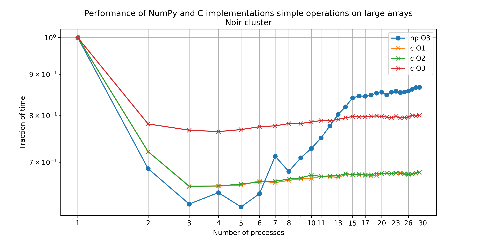

# Numpy parallel benchmark

While parallelising [gammapy]() operations, we observed that [numpy]() performance does not scale with the number of processes. This is a simple benchmark to illustrate the issue.

The slow-down also occurs in a single separate process as long as there are other similar processes running on the same machine. 
It suggests that the problem is not related to GIL, a particular parallelisation library or the way we use it, or simple forms of thread contention.